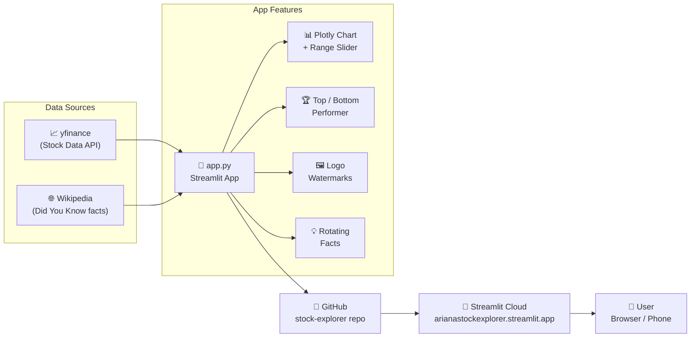
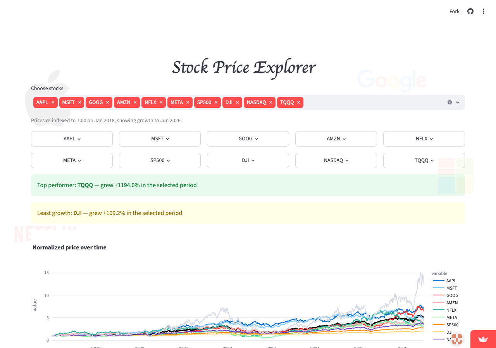

# 📈 Stock Price Explorer

A live, interactive stock dashboard built with Python and Streamlit — comparing big tech stocks and major indices from **January 2018 to June 2026**.

🔗 **Live app:** [arianastockexplorer.streamlit.app](https://arianastockexplorer.streamlit.app)

---

## Architecture



---

## Features

- **10 assets tracked** — AAPL, MSFT, GOOG, AMZN, NFLX, META, S&P 500, Dow Jones, Nasdaq, TQQQ
- **Normalised prices** — all lines start at 1.00 on Jan 2018 for fair comparison
- **Interactive chart** with a range slider to pan and zoom across 8 years of data
- **Popover metric cards** — tap a stock name to reveal its total growth
- **Top & bottom performer banners** — auto-updated based on selected stocks
- **Average line** — bold black line showing the mean across all 6 big tech stocks
- **30 rotating "Did You Know?" facts** — fetched from Wikipedia, one per company, cycling every 30 seconds
- **Logo watermarks** — semi-transparent SVG logos of each company in the background
- **Mobile-friendly** — responsive layout tested on phone screens

---

## Screenshot



---

## Tech Stack

| Tool | Purpose |
|------|---------|
| [Streamlit](https://streamlit.io) | Web app framework |
| [yfinance](https://github.com/ranaroussi/yfinance) | Real stock data (Jan 2018 → Jun 2026) |
| [Plotly](https://plotly.com) | Interactive charts |
| [Pandas](https://pandas.pydata.org) | Data processing |
| [Streamlit Cloud](https://streamlit.io/cloud) | Free deployment |

---

## Run Locally

```bash
git clone https://github.com/arianabutina-source/stock-explorer.git
cd stock-explorer
pip install -r requirements.txt
streamlit run app.py
```

---

## Reflection

This project started as a simple stock chart and grew into something I'd genuinely show to someone. The most interesting challenge was normalising prices to a common baseline — without that, comparing a $3,500 Amazon share to a $150 Netflix share is meaningless. Once everything starts at 1.00, the growth story becomes instantly readable.

The biggest surprise from the data: **TQQQ grew over 1,190%** from 2018 to 2026 — dwarfing every individual stock. But that comes with extreme volatility; during 2022 it lost over 80% of its value before recovering. That's a story no simple number tells — you have to look at the chart.

Adding the "Did You Know?" facts via live web fetch made the app feel less like a dashboard and more like something worth spending time on. Small detail, big difference.
